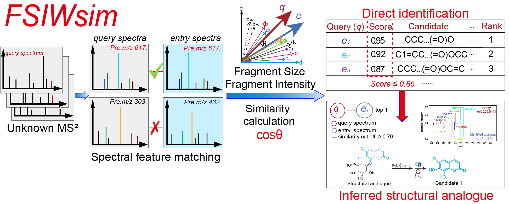

<!-- README.md is generated from README.Rmd. Please edit that file -->

# FSIWsim

## Description

<div class="figure" style="text-align: left">



<p class="caption">

FSIWsim

</p>

</div>

Untargeted UPLC-HRMS, which acquires MS2 spectra for the vast array of natural products (NPs) in traditional Chinese medicine (TCM), has become a pivotal technique for TCM constituent analysis. However, algorithms for assessing spectral similarity to determine structural resemblance and enable compound identification still require improvement. To address this, we developed a novel algorithm, the Fragment Size- and Intensity-Weighted MS2 similarity (FSIWsim), and established a comprehensive spectral database integrating MS2 spectra of 677,356 NPs from multiple platforms and laboratories. This method has been implemented in an open access R-based package called FSIWsim.

FSIWsim provides a robust and efficient tool for the rapid and reliable identification of known NPs in traditional Chinese medicine. The algorithm computes MS2 spectral similarity using cosine scores derived from vector representations of query and reference MS2 spectra in a combined feature space encompassing all matched fragment ions, neutral losses, and unmatched fragment ions. Not only does it emphasize matched spectral features, but it also penalizes similarity scores caused by unmatched fragment ions, thereby reducing false positive identifications. By weighting spectral features according to both their size (molecular weight) and intensity, FSIWsim more accurately reflects the underlying structural similarity between compounds, enabling direct and accurate identification of known compounds. Moreover, the FSIWsim similarity scoring framework paves the way for annotating NPs that are absent from the spectral database but are structurally analogous to known compounds. For compounds that were not directly identified in reference datasets, candidate structures closely similar to an identified structural analogue-even with a different precursor m/z-could be retrieved from broader chemical databases through substructure or similarity-based searches. This enables plausible annotation of otherwise unidentifiable query spectra, extending the method’s utility beyond exact database matches.


## Functions

**See the R help page for more details\!\!\!**

1. “data_path”: Path to the experimental MS2 data file. The file must be a CSV containing two columns: m/z and intensity, and its filename must be exactly: “nM271.0611T489.4550.csv”. In the filename, 271.0611 denotes the precursor ion's m/z, and 489.4550 denotes the retention time (rt).

2. “db_MS2”: Path to MS2 database folder

3. “db_NL”: Path to neutral loss database folder

4. “iden_dir”: Output directory for identification results (similarity >= sim_tolerance1)

5. “anno_dir”: Output directory for annotation results (similarity >= sim_tolerance2)

6. “sim_tolerance1”: Similarity threshold for identification (default: 0.65) (It is a user defined parameters)

7. “sim_tolerance2”: Similarity threshold for annotation (default: 0.70) (It is a user defined parameters)

8. “mztol”: m/z tolerance for matching (default: 0.005) (It is a user defined parameters)

9. “parallel”: Logical, whether to use parallel processing (default: TRUE)

10. “n_cores”: Number of cores to use for parallel processing. If NULL, uses total cores - 2 (default: NULL)

## Workflow for the calculating similarity between experimental MS/MS spectra and reference database spectra through FSIWsim

**For Demonstration Purposes Only\!\!\!**

**If you want to run the following code, you need to modify the file
path and some parameters according to your needs\!\!\!**

*install package*

``` r
devtools::install_local ("~/FSIWsim_1.0.0.tar.gz”)
```

*step1*

``` r
library (FSIWsim)
FSIWsim (
  data_path = "D:/DYL/0_test/TEST_20260225",
  db_MS2 = "D:/DYL/processed_results_MS2_4",
  db_NL = "D:/DYL/processed_results_NL_7",
  iden_dir = "D:/DYL/0_test/identification/results", sim_tolerance1 = 0.65,
  anno_dir = "D:/DYL/0_test/annotation/results", sim_tolerance2 = 0.70,
  mztol = 0.005,
  parallel = TRUE,
  n_cores = 123
)
```

## References


## Contact

If you need the database or have any questions, please do not hesitate to contact us at dengyaling@stu.cdutcm.edu.cn or kaifenghu@cdutcm.edu.cn
